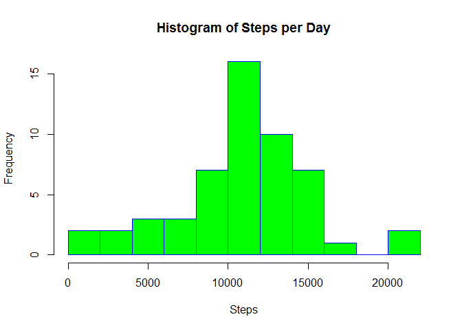
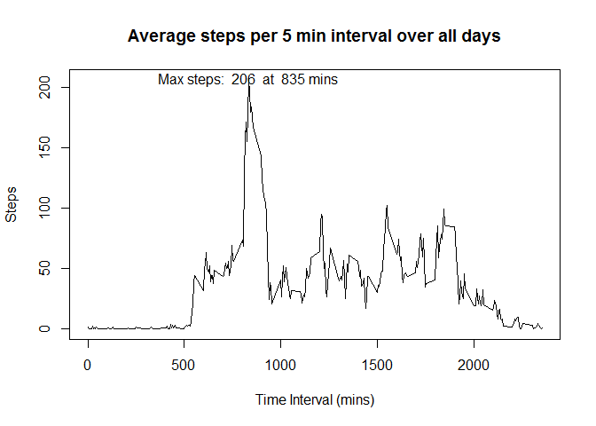
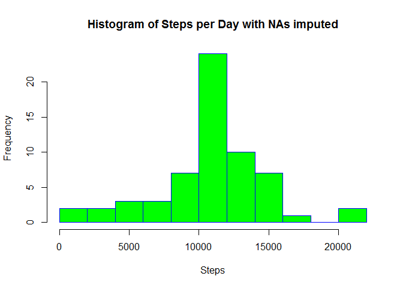
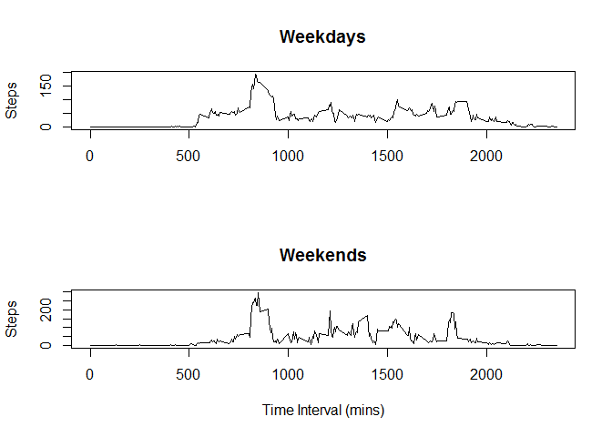

# Fitbit data
O Brill  
30 May 2017  


## Loading and preprocessing the data


```r
d<-read.csv("Activity.csv")
steps_per_day<-aggregate(steps~date,d,sum, rm.na=TRUE)
```

##Histogram of the total number of steps taken each day

Here is a histogram of the number of steps taken each day:

```r
hist(steps_per_day$steps, 
     main="Histogram of Steps per Day", 
     xlab="Steps", 
     border="blue", 
     col="green",
     breaks=10)
```

<!-- -->

```r
mean_steps<-round(mean(steps_per_day$steps))
median_steps<-round(median(steps_per_day$steps))
```

##Mean and median number of steps taken each day

The mean total number of steps taken per day was 10767.
The median total number of steps taken per day was 10766.

##Time series plot of the average number of steps taken

```r
steps_per_int<-aggregate(steps~interval,d,mean, rm.na=TRUE)
plot(steps_per_int, type = "l", main="Average steps per 5 min interval over all days", xlab = "Time Interval (mins)", ylab = "Steps")
max_steps<-max(steps_per_int$steps)
max_steps_at<-steps_per_int[steps_per_int$steps==max_steps,]$interval
 text(max_steps_at, max_steps, labels = paste("Max steps: ",round(max_steps), " at ", max_steps_at, "mins"))
```

<!-- -->

## The 5-minute interval that, on average, contains the maximum number of steps
The 5-minute interval that, on average, contains the maximum number of steps was at 835 mins.

##Code to describe and show a strategy for imputing missing data

Impute the missing data by replacing missing step values with the mean for that interval over all the days.


```r
missing_vals<-which(is.na(d$steps))
count_na_rows<-sum(rowSums(is.na(d))>0)
d_no_nas<-d
for (value in missing_vals){
  this_int<-d_no_nas$interval[value]
  k<-steps_per_int$interval==this_int
  d_no_nas$steps[value]<-steps_per_int$steps[k]
}
```

There are 2304 missing values in the data.

##Histogram of the total number of steps taken each day after missing values are imputed

Here is a histogram of the number of steps taken each day with the missing data removed:

```r
steps_per_day<-aggregate(steps~date,d_no_nas,sum)
hist(steps_per_day$steps, 
     main="Histogram of Steps per Day with NAs imputed", 
     xlab="Steps", 
     border="blue", 
     col="green",
     breaks=10)
```

<!-- -->

```r
mean_steps<-round(mean(steps_per_day$steps))
median_steps<-round(median(steps_per_day$steps))
```

With the NAs imputed:
The mean total number of steps taken per day was 10766.
The median total number of steps taken per day was 10766.
There are no significant changes in these values with the NAs imputed.

## Panel plot comparing the average number of steps taken per 5-minute interval across weekdays and weekends


```r
weekend<-wday(d_no_nas$date)==0|wday(d_no_nas$date)==6
d_no_nas<-mutate(d_no_nas, day="Weekday")
levels(d_no_nas$day)=c("Weekday","Weekend")
d_no_nas$day[weekend]="Weekend"

steps_per_int_wd<-aggregate(steps~interval,filter(d_no_nas,day=="Weekday"),mean)
steps_per_int_we<-aggregate(steps~interval,filter(d_no_nas,day=="Weekend"),mean)

par(mfrow=c(2,1))

plot(steps_per_int_wd, type = "l", main="Weekdays", xlab = "", ylab = "Steps")
plot(steps_per_int_we, type = "l", main="Weekends", xlab = "Time Interval (mins)", ylab = "Steps")
```

<!-- -->


